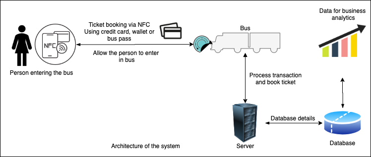

# AMPHack
Tap Ticket 

Forget about buying bus tickets or forgetting to refill your monthly pass, TapTicket is a digital wallet used for all of your transit needs. 
We propose a more efficient bus ticketing system where users use their phone to pay for their transit fare and making Canadians Lives Better by Advancing Ticketing System.

Techincal details - Android application.
The application uses ultaronic sound for transfering detaails over devices that can be used for ticket booking. It provides real-time ticket booking system without 
making a comuuter wait and be safe by providing contactless transcation.

